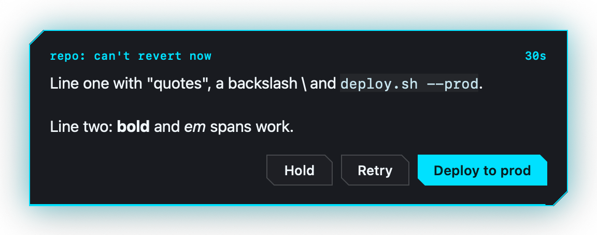

# ask-away

A native macOS prompt that lets coding agents ask the human a question - and get the clicked answer back on stdout. Comes with a matching agent skill.

One process, one question, one answer. The agent invokes `ask-away` with a title, a one-or-two-sentence body, and two or three buttons; a dark neon-edged panel appears over whatever the human is doing, takes Return and Escape without stealing focus from the host app, and the answer comes back as the clicked button's text, `CANCELED`, or `GAVE-UP`.



## Why

Agents block on questions. Terminal-based prompts go unseen the moment the human switches apps, and `osascript` dialogs look and behave like system dialogs owned by nobody. ask-away is a piece of the agent harness rendered where the human is:

- **Zero focus theft.** The panel takes key status for Return/Escape via a non-activating `NSPanel` - the app holding the human's attention keeps it.
- **One accent, one moment.** A cyan border, a mono metadata line, and the countdown ramp carry the urgency; the question body stays near-white and instantly readable. The panel is always dark.
- **Machine contract.** stdout is the answer, the exit code is the outcome, and parallel invocations cascade instead of stacking blindly.
- **Bounded asks.** `--give-up-after` drains a visible deadline; an expired ask returns `GAVE-UP` so the agent can take its documented fallback.

## Install

Script install (downloads the latest release, verifies it runs):

```sh
curl -fsSL https://raw.githubusercontent.com/dungle-scrubs/ask-away/main/install.sh | bash
```

The pipe form installs the binary to `/usr/local/bin` (override with `--prefix DIR`, which you may need to run under `sudo`). To also install the agent skill:

```sh
install.sh --skill-dir ~/.agents/skills/ask-away
```

Build from source instead (needs Xcode's Swift toolchain):

```sh
git clone https://github.com/dungle-scrubs/ask-away.git
cd ask-away
./build.sh
install.sh --build-from-source --prefix /usr/local/bin --skill-dir ~/.agents/skills/ask-away
```

`build.sh` compiles a universal binary (arm64 + x86_64, macOS 13+) with `swiftc` and ad-hoc signs it. There is no Homebrew formula on purpose.

## CLI reference

```sh
ask-away --title "repo: what this decides" \
         --text "One or two short sentences." \
         --buttons "Cancel" "Option A" "Option A + B" \
         [--default N] [--give-up-after SECONDS] [--no-beep]
```

| Flag | Meaning |
|---|---|
| `--title TITLE` | One line, shown in mono cyan: `repo-name: what this decides`. |
| `--text TEXT` | One or two sentences. Inline `code`, **strong**, *em* render; real newlines become paragraph breaks. |
| `--buttons B1 [B2] [B3]` | Two or three buttons, left to right in the order given. Rightmost is the recommended answer. |
| `--default N` | 1-based button that takes Return and the filled accent style. Defaults to the LAST button. Position never changes; the fill marks the recommendation. |
| `--give-up-after S` | Close unanswered after S seconds: the panel drains a countdown line and prints `GAVE-UP`. |
| `--no-beep` | Suppress the single beep at appearance. |

| stdout | exit | meaning |
|---|---|---|
| button text | 0 | the human chose |
| `CANCELED` | 2 | Escape, or a button named "Cancel" was activated |
| `GAVE-UP` | 3 | the bound expired unanswered |
| usage message on stderr | 1 | bad flags |

`--help` prints the same reference and exits 0.

## Behavior

- Appears on the screen holding the pointer, horizontally centered, slightly above center; never repositions.
- Cascades +24pt down-right per concurrent panel (wraps after 6) so parallel agents stay readable.
- Return triggers the default button; Escape cancels; no other keys are bound.
- The countdown drain line and the seconds text share one color that ramps cyan -> amber -> red as the bound expires.
- VoiceOver: the panel exposes the title, the body reads as plain text, the countdown updates silently, and the default button cell drives Return.
- Reduce Motion replaces the entrance and exit motion with fades.

## Skill installation

`skill/` is a self-contained agent skill whose `ask.sh` drives the binary when it is installed and falls back to AppleScript `display dialog` (same flags, same stdout and exit contract) when it is not. Point `install.sh --skill-dir` at your agent's skill directory; common ones:

| Agent | Directory |
|---|---|
| This house's agents | `~/.agents/skills/ask-away` |
| Claude Code (project) | `.claude/skills/ask-away` |
| Claude Code (user) | `~/.claude/skills/ask-away` |
| Any agent that scans a skills dir | copy `skill/` there |

The fallback needs no extra macOS permission. The native binary needs none either; only an agent that drives synthetic input for tests needs Accessibility, and that permission belongs to the calling terminal, not to ask-away.

## Development

```sh
./build.sh                                   # universal binary into bin/ (git-ignored)
.scratch/ask-away-impl/run_tests.sh          # behavioral suite, if present
```

See [CONTRIBUTING.md](CONTRIBUTING.md) for the commit format and [SECURITY.md](SECURITY.md) for reporting vulnerabilities.

## License

[MIT](LICENSE)
